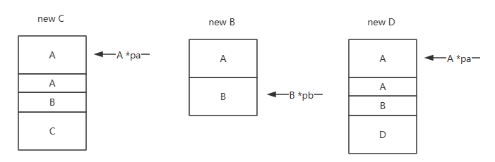

# Chapter 19. Specialized  Tools and Techniques

## [Exercise 19.1](ex19_01.cpp)

## Exercise 19.2 [Header](ex19_02.h) | [Cpp](ex19_02.cpp)

## Exercise 19.3

> Given the following class hierarchy in which each class defines a public default constructor and virtual destructor:

```c++
class A { /* ... */};
class B : public A { /* ... */};
class C : public B { /* ... */};
class D : public B, public A { /* ... */};
```

> which, if any, of the following dynamic_casts fail?

```c++
(a) A *pa = new C;
	B *pb = dynamic_cast<B*>(pa);
(b) B *pb = new B;
	C *pc = dynamic_cast<C*>(pb);
(c) A *pa = new D;
	B *pb = dynamic_cast<B*>(pa);
```

```c++
(a) Success;
(b) Failed, PB is a pointer to B and cannot be converted to a pointer to C;
(c) Failed, A * pa=new D has ambiguity.
```

If you want to gain a deeper understanding of the issue, you can refer to the following diagram:



## Exercise 19.4

> Using the classes defined in the first exercise, rewrite the following code to convert the expression *pa to the type C&:

```c++
if (C *pc = dynamic_cast<C*>(pa))
{
	// use C's members
} else {
	// use A's members
}
```

```c++
#include <typeinfo>
#include <iostream>

class A
{
public:
	virtual ~A() {}
};

class B : public A
{};

class C : public B
{};

class D : public B, public A
{};

int main(int argc, char const *argv[])
{
	// A *pa = new C;
	// B *pb = dynamic_cast<B*>(pa);
	// if(pb) std::cout << "success" << std::endl;
	// else std::cout << "fail" << std::endl;

	// B *pb = new B;
	// C *pc = dynamic_cast<C*>(pb);
	// if(pc) std::cout << "success" << std::endl;
	// else std::cout << "fail" << std::endl;

	// A *pa = new D;
	// B *pb = dynamic_cast<B*>(pa);
	// if(pb) std::cout << "success" << std::endl;
	// else std::cout << "fail" << std::endl;

	A *pa = new C;
	try{
		const C &c = dynamic_cast<const C&>(*pa);
	}catch(std::bad_cast &e){
		std::cout << e.what() << std::endl;
	}

	return 0;
}
```

## Exercise 19.5

> When should you use a dynamic_cast instead of a virtual function?

If we want to perform a derived class operation using a pointer or reference to a base class object and the operation is not a virtual function, we can use the RTTI operator (the class type should contain a virtual function)

## Exercise 19.6

> Write an expression to dynamically cast a pointer to a Query_base to a pointer to an AndQuery (§ 15.9.1, p. 636). Test the cast by using objects of AndQuery and of another query type. Print a statement indicating whether the cast works and be sure that the output matches your expectations.

```c++
#include <iostream>
 
using namespace std;
 
class Query_base
{
public:
    Query_base() { }
    virtual ~Query_base() { }
    // ...
};
 
class BinaryQuery: public Query_base
{
public:
    BinaryQuery() { }
    virtual ~BinaryQuery() { }
    // ...
};
 
class AndQuery: public BinaryQuery
{
public:
    AndQuery() { }
    virtual ~AndQuery() { }
    // ...
};
 
int main()
{
    Query_base *qb = new Query_base;
    if(dynamic_cast<AndQuery*>(qb) != nullptr)
    {
        cout << "success.=========" << endl;
    }
    else
    {
        cout << "failure.=========" << endl;
    }
 
    return 0;
}
```

## Exercise 19.7

> Write the same cast, but cast a Query_base object to a reference to AndQuery. Repeat the test to ensure that your cast works correctly.

```c++
#include <iostream>
#include <typeinfo>
 
using namespace std;
 
class Query_base
{
public:
    Query_base() { }
    virtual ~Query_base() { }
    // ...
};
 
class BinaryQuery: public Query_base
{
public:
    BinaryQuery() { }
    virtual ~BinaryQuery() { }
    // ...
};
 
class AndQuery: public BinaryQuery
{
public:
    AndQuery() { }
    virtual ~AndQuery() { }
    // ...
};
 
int main()
{
    Query_base *qb = new Query_base;
    try
    {
        dynamic_cast<AndQuery*>(qb);
        cout << "success.=========" << endl;
    }
    catch(bad_cast &bc)
    {
        cout << "failure.=========" << endl;
    }
 
    return 0;
}
```

## Exercise 19.8

> Write a typeid expression to see whether two Query_base pointers point to the same type. Now check whether that type is an AndQuery.

```c++
Query_base* qb1, qb2;
// Does it point to the same type
typeid(*qb1) == typeid(*qb2)
// Determine if the type is AndQuery
typeid(*qb1) == typeid(AndQuery)
```

## [Exercise 19.9](ex19_09.cpp)

> Write a program similar to the last one in this section to print the names your compiler uses for common type names. If your compiler gives output similar to ours, write a function that will translate those strings to more human-friendly form.

## [Exercise 19.10](ex19_09.h)

> Given the following class hierarchy in which each class defines a public default constructor and virtual destructor, which type name do the following statements print?

```c++
class A { /* ... */ };
class B : public A { /* ... */ };
class C : public B { /*...*/ };
(a) 	A *pa = new C;
	cout << typeid(pa).name() << endl;
(b)	 C cobj;
	A& ra = cobj;
	cout << typeid(&ra).name() << endl;
(c) 	B *px = new B;
	A& ra = *px;
	cout << typeid(ra).name() << endl;
```

```c++
(a) Class A*
Because pa is a pointer to an A-class object of type A *.
(b) Class A*
Because ra is a reference to an A-class object, the expression&ra obtains the address of ra, which is of type A*
(c) Class A
Because ra is a reference to an A-class object, its type is A.
```

## Exercise 19.11

> What is the difference between an ordinary data pointer and a pointer to a data member?

A regular data pointer points to an object; The class member pointer points to the non-static member of the class. When initializing such a pointer, we make it point to a member of the class, but do not specify the object to which that member belongs; The object to which it belongs is only provided when using member pointers.

## [Exercise 19.12](ex19_12.cpp)

## Exercise 19.13

> Define the type that can represent a pointer to the bookNo member of the Sales_data class.

```c++
const std::string Sales_data::*pdata;
```

## Exercise 19.14

> Is the following code legal? If so, what does it do? If not, why?

```c++
auto pmf = &Screen::get_cursor;
pmf = &Screen::get;
```

Illegal, get in Screen_ The cursor function returns a POS type, while the get function returns a char type.

## Exercise 19.15

> What is the difference between an ordinary function pointer and a pointer to a member function?

Unlike regular function pointers, there is no automatic conversion rule between a member function and a pointer to that member.

## Exercise 19.16

> Write a type alias that is a synonym for a pointer that can point to the avg_price member of Sales_data.

```c++
using AvgPrice = double (Sales_data::*)() const;
AvgPrice avgprice = &Sales_data::avg_price;
```

## [Exercise 19.17](ex19_17.cpp)

> Define a type alias for each distinct Screen member function type.

## [Exercise 19.18](ex19_18.cpp)

## Exercise 19.19:

> Write a function that takes a vector<Sales_data> and finds the first element whose average price is greater than some given amount.

```c++
bool check_value(Sales_data &sd, double t)
{
	return sd.avg_price() > t;
}
 
vector<Sales_data>::iterator find_first_high(vector<Sales_data> &vsd, double t)
{
	auto f = bind(check_value, _1, t);
	return find_if(vsd.begin(), vsd.end(), f);
}
```

## [Exercise 19.20](ex19_20.h)

## [Exercise 19.21](ex19_21.cpp)

## [Exercise 19.22](ex19_21.cpp)

## [Exercise 19.23](ex19_21.cpp)

## [Exercise 19.24](ex19_21.cpp)

## [Exercise 19.25](ex19_21.cpp)

## Exercise 19.26

> Explain these declarations and indicate whether they are legal:

```c++
extern "C" int compute(int *, int);
extern "C" double compute(double *, double);
```

Illegal, C language does not support function overloading
